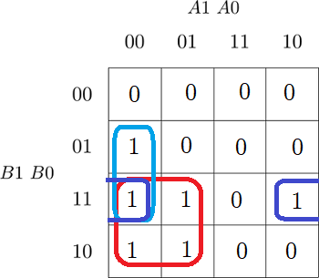
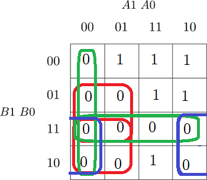
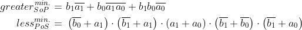

# Lab 2: Christopher Koiš

### 2-bit comparator

1. Karnaugh maps for other two functions of 2-bit comparator:

   Greater than:

   

   Less than:

   

2. Mark the largest possible implicants in the K-map and according to them, write the equations of simplified SoP (Sum of the Products) form of the "greater than" function and simplified PoS (Product of the Sums) form of the "less than" function.

   

<!-- LaTeX equations 
\begin{align*}

greater_{SoP}^{min.} =&~ b_{1}\overline{a_{1}}+b_{0}\overline{a_{1}}\overline{a_{0}}+b_{1}b_{0}\overline{a_{0}}\\

less_{PoS}^{min.} = &~ \left ( \overline{b_{0}}+a_{1} \right )\cdot \left ( \overline{b_{1}}+a_{1} \right ) \cdot \left ( a_{1}+a_{0} \right )\cdot \left ( b_{1}+b_{0} \right )\cdot \left ( \overline{b_{1}}+\overline{a_{1}}+a_{0} \right )

\end{align*} 
-->

### 4-bit comparator

1. Listing of VHDL stimulus process from testbench file (`testbench.vhd`) with at least one assert (use BCD codes of your student ID digits as input combinations). Always use syntax highlighting, meaningful comments, and follow VHDL guidelines:

   Last two digits of my student ID: **xxxx35**

```vhdl
    p_stimulus : process
    begin
        -- Report a note at the beginning of stimulus process
        report "Stimulus process started" severity note;

        -- First test case
        s_b <= "0011";        -- Such as "0101" if ID = xxxx56
        s_a <= "0101";        -- Such as "0110" if ID = xxxx56
        wait for 100 ns;
        -- Expected output
        assert ((s_B_greater_A = '0') and
                (s_B_equals_A  = '0') and
                (s_B_less_A    = '1'))
        -- If false, then report an error
        report "Input combination COMPLETE_THIS_TEXT FAILED" severity error;

        -- Report a note at the end of stimulus process
        report "Stimulus process finished" severity note;
        wait;
    end process p_stimulus;
```

2. Link to your public EDA Playground example:

   [https://www.edaplayground.com/JQtj](https://www.edaplayground.com/x/JQtj)
