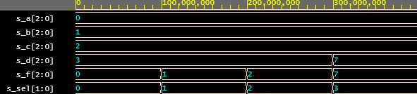

# Lab 3: Christopher Koiš

### Three-bit wide 4-to-1 multiplexer

1. Listing of VHDL architecture from source file `mux_3bit_4to1.vhd`. Always use syntax highlighting, meaningful comments, and follow VHDL guidelines:

```vhdl
architecture Behavioral of mux is
begin
    f <= a when sel = "00" else
         b when sel = "01" else
         c when sel = "10" else
         d;

end architecture Behavioral;
```

2. Screenshot with simulated time waveforms. Always display all inputs and outputs (display the inputs at the top of the image, the outputs below them) at the appropriate time scale!

   

3. Listing of pin assignments for the Nexys A7 board in `nexys-a7-50t.xdc`. **DO NOT list** the whole file, just your switch and LED settings.

```shell
##Switches
set_property -dict { PACKAGE_PIN J15   IOSTANDARD LVCMOS33 } [get_ports { a[0] }]; #IO_L24N_T3_RS0_15 Sch=sw[0]
set_property -dict { PACKAGE_PIN L16   IOSTANDARD LVCMOS33 } [get_ports { a[1] }]; #IO_L3N_T0_DQS_EMCCLK_14 Sch=sw[1]
set_property -dict { PACKAGE_PIN M13   IOSTANDARD LVCMOS33 } [get_ports { a[2] }]; #IO_L6N_T0_D08_VREF_14 Sch=sw[2]

set_property -dict { PACKAGE_PIN R15   IOSTANDARD LVCMOS33 } [get_ports { b[0] }]; #IO_L13N_T2_MRCC_14 Sch=sw[3]
set_property -dict { PACKAGE_PIN R17   IOSTANDARD LVCMOS33 } [get_ports { b[1] }]; #IO_L12N_T1_MRCC_14 Sch=sw[4]
set_property -dict { PACKAGE_PIN T18   IOSTANDARD LVCMOS33 } [get_ports { b[2] }]; #IO_L7N_T1_D10_14 Sch=sw[5]

set_property -dict { PACKAGE_PIN U18   IOSTANDARD LVCMOS33 } [get_ports { c[0] }]; #IO_L17N_T2_A13_D29_14 Sch=sw[6]
set_property -dict { PACKAGE_PIN R13   IOSTANDARD LVCMOS33 } [get_ports { c[1] }]; #IO_L5N_T0_D07_14 Sch=sw[7]
set_property -dict { PACKAGE_PIN T8    IOSTANDARD LVCMOS18 } [get_ports { c[2] }]; #IO_L24N_T3_34 Sch=sw[8]

set_property -dict { PACKAGE_PIN U8    IOSTANDARD LVCMOS18 } [get_ports { d[0] }]; #IO_25_34 Sch=sw[9]
set_property -dict { PACKAGE_PIN R16   IOSTANDARD LVCMOS33 } [get_ports { d[1] }]; #IO_L15P_T2_DQS_RDWR_B_14 Sch=sw[10]
set_property -dict { PACKAGE_PIN T13   IOSTANDARD LVCMOS33 } [get_ports { d[2] }]; #IO_L23P_T3_A03_D19_14 Sch=sw[11]

set_property -dict { PACKAGE_PIN U11   IOSTANDARD LVCMOS33 } [get_ports { sel[0] }]; #IO_L19N_T3_A09_D25_VREF_14 Sch=sw[14]
set_property -dict { PACKAGE_PIN V10   IOSTANDARD LVCMOS33 } [get_ports { sel[1] }]; #IO_L21P_T3_DQS_14 Sch=sw[15]
...

## LEDs
set_property -dict { PACKAGE_PIN U17   IOSTANDARD LVCMOS33 } [get_ports { f[0] }]; #IO_L17P_T2_A14_D30_14 Sch=led[6]
set_property -dict { PACKAGE_PIN U16   IOSTANDARD LVCMOS33 } [get_ports { f[1] }]; #IO_L18P_T2_A12_D28_14 Sch=led[7]
set_property -dict { PACKAGE_PIN V16   IOSTANDARD LVCMOS33 } [get_ports { f[2] }]; #IO_L16N_T2_A15_D31_14 Sch=led[8]
...
```
