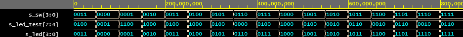

# Lab 4: Christopher Koiš

### LED(7:4) indicators

1. Complete the truth table for LEDs(7:4) according to comments in source code.

   | **Hex** | **Inputs** | **LED4** | **LED5** | **LED6** | **LED7** |
   | :-: | :-: | :-: | :-: | :-: | :-: |
   | 0 | 0000 | 1 | 0 | 0 | 0 |
   | 1 | 0001 | 0 | 0 | 1 | 1 |
   | 2 | 0010 | 0 | 0 | 0 | 1 |
   | 3 | 0011 | 0 | 0 | 1 | 0 |
   | 4 | 0100 | 0 | 0 | 0 | 1 |
   | 5 | 0101 | 0 | 0 | 1 | 0 |
   | 6 | 0110 | 0 | 0 | 0 | 0 |
   | 7 | 0111 | 0 | 0 | 1 | 0 |
   | 8 | 1000 | 0 | 0 | 0 | 1 |
   | 9 | 1001 | 0 | 0 | 1 | 0 |
   | A | 1010 | 0 | 1 | 0 | 0 |
   | b | 1011 | 0 | 1 | 1 | 0 |
   | C | 1100 | 0 | 1 | 0 | 0 |
   | d | 1101 | 0 | 1 | 1 | 0 |
   | E | 1110 | 0 | 1 | 0 | 0 |
   | F | 1111 | 0 | 1 | 1 | 0 |

2. Listing of LEDs(7:4) part of VHDL architecture from source file `top.vhd`. Try to write logic functions as simple as possible. Always use syntax highlighting, meaningful comments, and follow VHDL guidelines:

   ```vhdl
   --------------------------------------------------------------------
   -- Experiments on your own: LED(7:4) indicators

   -- Turn LED(4) on if input value is equal to 0, ie "0000"
   LED(4) <= '1' when SW = "0000" else '0';

   -- Turn LED(5) on if input value is greater than "1001", ie 10, 11, 12, ...
   LED(5) <= '1' when SW > "1001" else '0';

   -- Turn LED(6) on if input value is odd, ie 1, 3, 5, ...
   LED(6) <= SW(0);

   -- Turn LED(7) on if input value is a power of two, ie 1, 2, 4, or 8
   LED(7) <= '1' when SW = "0001" or SW = "0010" or SW = "0100" or SW = "1000" else '0';
   ```

3. Screenshot with simulated time waveforms for LED(7:4). Always display all inputs and outputs (display the inputs at the top of the image, the outputs below them) at the appropriate time scale!

   
